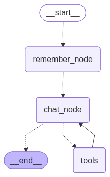

# 🤖 Agentic RAG Chatbot with Long-Term Memory

An intelligent, multi-tool conversational **agent** built with **LangGraph** and **Streamlit** — it doesn't just reply, it *decides*: when to search the web, query your PDFs, fetch a live stock price, run a calculation, or call an MCP tool. It also remembers relevant facts about you across sessions, so it gets more personalized the more you use it.

---

## ⚙️ How It Works Internally



### 1. The Agent Graph
The chatbot is built as a graph of nodes:
- **`remember_node`** → looks at your latest message and decides if anything new should be saved to memory.
- **`chat_node`** → generates the actual reply, with access to all tools.
- **`tools` node** → executes whichever tool the model decided to call.

The graph loops between `chat_node` and `tools` until the model has everything it needs to answer.

### 2. Memory System
- **Short-term memory** lives in `chatbot.db` and stores the full message history per chat thread (so each "New Chat" is independent).
- **Long-term memory** lives in `ltm.db` and stores atomic facts about the user (e.g., *"User's name is Vaibhav"*, *"User works with LangGraph"*). Before every reply, an LLM call checks your message for new facts and only saves genuinely new information (no duplicates).

### 3. Document Q&A (RAG)
When you upload a PDF, it's split into chunks, embedded, and stored in a **FAISS index** unique to that chat thread. When you ask a question, the most relevant chunks are retrieved and given to the model as context.

### 4. Expense Tracking via MCP
The expense tracker is a completely separate program (`expense-tracker-mcp-server/main.py`) that runs as its own process. It exposes tools like `add_expense`, `list_expenses`, `summarize`, and `delete_expense`. The chatbot talks to it using the **Model Context Protocol**, meaning the tracker could even be swapped out or reused by a totally different AI application.

---

## ✨ Features

| Feature | Description |
|---|---|
| 🧠 **Long-Term Memory** | Learns and stores facts about the user across sessions using a persistent SQLite-backed memory store |
| 💬 **Short-Term Memory** | Keeps track of the ongoing conversation per chat thread |
| 📄 **PDF-based RAG** | Upload a PDF and ask questions about its content — powered by FAISS vector search |
| 🌐 **Web Search** | Fetches real-time information from the internet using Tavily |
| 📈 **Stock Price Lookup** | Gets live stock quotes using the Alpha Vantage API |
| 🧮 **Calculator** | Performs basic arithmetic operations |
| 💰 **Expense Tracker (MCP)** | A separate MCP (Model Context Protocol) server that lets the bot add, update, delete, and summarize your expenses |
| 🔀 **Multi-threaded Conversations** | Create and switch between multiple independent chat sessions |
| ⚡ **Streaming Responses** | Answers stream in token-by-token for a smooth, real-time chat feel |

---

## 🏗️ Architecture

This shows what's actually running behind the graph — the models, storage, and tools:

```
                    Streamlit UI (streamlit_frontend_tool.py)
                                  │
                                  ▼
                     LangGraph Agent (StateGraph)
                                  │
        ┌─────────────────┬──────┴───────┬─────────────────┐
        ▼                 ▼              ▼                 ▼
  remember_node        chat_node      tools node      Checkpointer
        │           (gpt-4.1-mini)         │           (SqliteSaver
        ▼            via ChatOpenAI        │            → chatbot.db)
 Long-Term Memory                          │           per-thread chat
  (SqliteStore                             │              history
   → ltm.db)                               │
  atomic facts                             │
  about the user                           │
                                           │
        ┌───────────────┬──────────────────┼───────────────────┬───────────────────────┐
        ▼               ▼                  ▼                   ▼                       ▼
   FAISS RAG      Tavily Search       Calculator          Stock Price           MCP Expense Tracker
   Tool                Tool              Tool             Tool                  (FastMCP server,
   (per-thread                                            (Alpha Vantage          separate process,
    vector index,                                          GLOBAL_QUOTE API)       expenses.db)
    text-embedding-
    3-small)                                                  
        │                                                      
        ▼                                             
  Uploaded PDFs                                    
  (chunked +                                           
   embedded)                                        
```

---

## 🛠️ Tech Stack

| Layer | Technology |
|---|---|
| Agent orchestration | [LangGraph](https://www.langchain.com/langgraph) (`StateGraph`, conditional tool routing) |
| LLM | OpenAI `gpt-4.1-mini` (chat), `gpt-4o-mini` (memory extraction) |
| Embeddings | OpenAI `text-embedding-3-small` |
| Web search | Tavily |
| Stock data | Alpha Vantage |
| External tools | [MCP (Model Context Protocol)](https://modelcontextprotocol.io/) via `langchain-mcp-adapters` |
| Short-Term Memory | `SqliteSaver` |
| Long-Term Memory | `SqliteStore` |
| Frontend | [Streamlit](https://streamlit.io/) |
| Vector store | FAISS |

---

## 📁 Project Structure

```
Agentic-RAG-Chatbot-with-Long-Term-Memory/
│
├── langgraph_tool_backend.py      # Core agent logic: graph, tools, memory, RAG
├── streamlit_frontend_tool.py     # Streamlit chat UI, PDF upload, threading
├── requirements.txt               # Python dependencies
├── .env.example                   # Example environment variables file
├── .gitignore
├── LICENSE
│
└── expense-tracker-mcp-server/    # Standalone MCP server for expense tracking
    ├── main.py                    # MCP tool definitions (add/list/update/delete/summarize)
    ├── categories.json            # Allowed expense categories & subcategories
    ├── pyproject.toml
    ├── uv.lock
    └── .python-version
```

---

## 🚀 Getting Started

### Prerequisites
- Python 3.10+
- API keys for:
  - [OpenAI](https://platform.openai.com/) (for the LLM and embeddings)
  - [Tavily](https://tavily.com/) (for web search)
  - [Alpha Vantage](https://www.alphavantage.co/) (for stock prices)

### 1. Clone the repo
```bash
git clone https://github.com/<your-username>/agentic-rag-chatbot.git
cd agentic-rag-chatbot
```

### 2. Create a virtual environment and install dependencies
```bash
python -m venv .venv
source .venv/bin/activate      # On Windows: .venv\Scripts\activate
pip install -r requirements.txt
```

### 3. Configure environment variables
Copy the example file and fill in your keys:
```bash
cp .env.example .env
```

```
OPENAI_API_KEY=your_openai_key_here
TAVILY_API_KEY=your_tavily_key_here
ALPHAVANTAGE_API_KEY=your_alphavantage_key_here
```

### 4. Run the app
```bash
streamlit run app.py
```
The app will open at `http://localhost:8501`.

---

## 💡 Usage

1. **Start a new chat** from the sidebar, or resume a past conversation.
2. **Upload a PDF** (optional) to enable document-grounded Q&A for that thread.
3. **Chat naturally** — ask general questions, request stock prices, do math, or ask about the uploaded document. The agent decides which tool(s) to use.
4. Over time, the assistant **remembers stable facts about you** (name, projects, preferences) and personalizes its responses and greetings accordingly.

---
